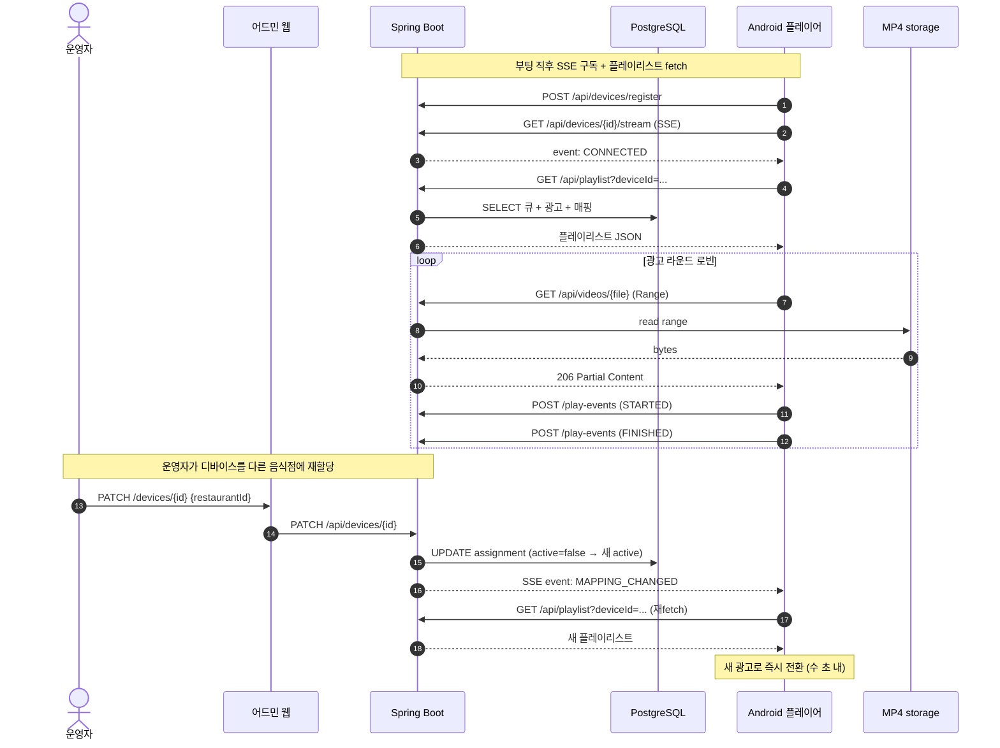

# AdSignage — 음식점 주류 냉장고 디지털 광고판 송출 서비스

음식점의 주류 쇼케이스 냉장고 상단에 거치형 디지털 사이니지를 설치해 주류 메이커(진로하이트, 오비맥주, 롯데주류 등)의 광고를 송출하는 서비스입니다. 광고비의 일부는 음식점 사장님에게 분배합니다.

## 데모 시나리오 (해커톤)

1. **광고주 어드민**: 회원가입/로그인 → MP4 영상 업로드 → 시간대/일일 송출횟수 스케줄 설정
2. **광고판 재생**: 안드로이드 디바이스 2대가 스케줄에 따라 광고를 라운드 로빈 재생, 스케줄 외 시간엔 회사 로고 스플래시
3. **원격 재할당**: 어드민에서 디바이스↔음식점 매핑을 변경 → SSE 푸시로 수 초 내에 디바이스 화면 갱신

## 아키텍처

### 전체 시스템 구조

```mermaid
flowchart TB
    subgraph clients["클라이언트"]
        Browser["광고주 브라우저<br/>(Chrome/Safari/모바일)"]
        Android["Android WebView APK<br/>(광고판 디바이스 N대)"]
    end

    subgraph proxy["nginx · owl-SER8 (Ubuntu, HTTPS · Let's Encrypt)"]
        WebHost["stream.owl-dev.me<br/>→ 127.0.0.1:3002"]
        ApiHost["stream-backend.owl-dev.me<br/>→ 127.0.0.1:8080<br/><i>SSE: read_timeout 24h</i>"]
    end

    subgraph runtime["애플리케이션 (docker compose)"]
        Web["Next.js 14 어드민 + 플레이어<br/>:3000<br/><i>/login, /signup, /videos, /ads, /devices, /profile<br/>/player/&#123;deviceId&#125;</i>"]
        Backend["Spring Boot 3 (Kotlin) :8080<br/><b>JWT auth · REST · SSE · video range</b><br/><i>9 bounded contexts</i>"]
    end

    subgraph storage["저장소"]
        Postgres[("PostgreSQL<br/>schema=adsignage<br/><i>Flyway migration</i>")]
        Videos[/"호스트 볼륨<br/>/var/lib/adsignage/videos/*.mp4"/]
    end

    Browser -->|HTTPS| WebHost
    Android -->|HTTPS<br/>WebView 풀스크린| WebHost
    Browser -.->|"JWT 첨부<br/>fetch / SSE"| ApiHost
    Android -.->|"play-event POST<br/>SSE subscribe"| ApiHost

    WebHost --> Web
    ApiHost --> Backend

    Web -.->|"SSR fetch (있을 때)"| Backend
    Backend --> Postgres
    Backend -->|"MP4 read · range"| Videos
    Backend -.->|"MP4 write<br/>(video upload)"| Videos
```



### 광고 송출 + 매핑 변경 흐름 (SSE)



### 백엔드 — 9 bounded contexts (헥사고날)

```mermaid
flowchart LR
    subgraph adapters["adapter/in (REST + SSE)"]
        AuthC["AuthController<br/>/api/auth/*"]
        VideoC["VideoController · VideoStreamingController<br/>/api/videos · /api/videos/&#123;file&#125;"]
        AdC["AdController · AdPlayCountController<br/>/api/ads"]
        DeviceC["DeviceController · DeviceUpdateController<br/>/api/devices"]
        QueueC["DeviceAdQueueController<br/>/api/devices/&#123;id&#125;/queue"]
        AssignC["DeviceAssignmentController<br/>/api/devices/&#123;id&#125;/assignment"]
        RestC["RestaurantController<br/>/api/restaurants"]
        PlaylistC["PlaylistController<br/>/api/playlist"]
        StreamC["DeviceStreamController<br/>/api/devices/&#123;id&#125;/stream (SSE)"]
        PlayEventC["PlayEventController<br/>/api/devices/&#123;id&#125;/play-events"]
    end

    subgraph contexts["application/service · 9 contexts"]
        Advertiser["advertiser<br/>(JWT principal)"]
        Video["video"]
        Ad["ad"]
        Device["device"]
        Queue["queue<br/>(DeviceAdQueue)"]
        Assignment["assignment<br/>(Device ↔ Restaurant)"]
        Playlist["playlist<br/>(round-robin)"]
        Restaurant["restaurant"]
        PlayEvent["playevent"]
    end

    subgraph ports["application/port/out"]
        Repos["JPA Repository ports<br/>(Spring Data Adapter)"]
        Sse["SseEmitterRegistry<br/>(in-memory)"]
    end

    AuthC --> Advertiser
    VideoC --> Video
    AdC --> Ad
    DeviceC --> Device
    QueueC --> Queue
    AssignC --> Assignment
    RestC --> Restaurant
    PlaylistC --> Playlist
    StreamC --> Device
    PlayEventC --> PlayEvent

    Advertiser --> Repos
    Video --> Repos
    Ad --> Repos
    Device --> Repos & Sse
    Queue --> Repos
    Assignment --> Repos
    Playlist --> Repos
    Restaurant --> Repos
    PlayEvent --> Repos & Device

    Device -.->|"광고 큐 변경 시<br/>PLAYLIST_UPDATE"| Sse
    Assignment -.->|"재할당 시<br/>MAPPING_CHANGED"| Sse

    Repos --> PG[("PostgreSQL<br/>schema=adsignage")]
```



> **Legacy ASCII 다이어그램** (참고용 fallback)
>
> ```
> [Android]/[브라우저] → nginx → Next.js :3000  + Spring Boot :8080 → PostgreSQL + /var/lib/adsignage/videos
> ```

## 컴포넌트

| 디렉토리 | 역할 | 빌드 |
|---|---|---|
| [backend/](./backend/README.md) | Spring Boot 3 + Kotlin REST API + SSE | `./gradlew bootJar` |
| [web/](./web/README.md) | Next.js 어드민 + 플레이어 페이지 | `npm run build` |
| [android/](./android/README.md) | Kotlin WebView 래퍼 APK | `./gradlew assembleDebug` |
| [deploy/](./deploy/README.md) | nginx, systemd, TLS 프로비저닝 스크립트 | — |

## 인프라

- **호스트**: `owl-SER8` (Ubuntu, 192.168.0.24)
- **공인 IP**: 110.8.21.243 (192.168.0.24로 포트포워딩)
- **도메인**: `stream.owl-dev.me`
- **HTTPS**: Let's Encrypt (`deploy/scripts/provision-tls.sh`)
- **백엔드 서비스**: systemd unit (`deploy/scripts/adsignage-backend.service`)

## 빠른 시작 (로컬 개발)

### 옵션 A — 호스트에서 직접

```bash
# 1. 백엔드
cd backend && ./gradlew bootRun

# 2. 어드민 웹
cd web && npm install && npm run dev

# 3. 안드로이드 (Android Studio에서 열거나)
cd android && ./gradlew assembleDebug
```

### 옵션 B — Docker compose

```bash
cp .env.example .env
# JWT_SECRET 채우고
docker compose up --build
# → backend  http://127.0.0.1:8080
# → web      http://127.0.0.1:3000
```

자세한 도커 운영은 [`deploy/DOCKER.md`](deploy/DOCKER.md).

## 배포

### Docker (권장)

CI(`.github/workflows/docker-publish.yml`) 가 main push 마다 ghcr 로 두 이미지를
푸시한다:

- `ghcr.io/jinsujj/adsignage-backend:{main,sha-XXXXXXX,latest}`
- `ghcr.io/jinsujj/adsignage-web:{main,sha-XXXXXXX,latest}`

서버(owl-SER8) 에서:

```bash
cd /opt/adsignage/src
git pull --ff-only
docker compose pull
docker compose up -d
```

### Legacy (systemd jar)

```bash
scp backend/build/libs/adsignage-0.0.1-SNAPSHOT.jar \
    owl@110.8.21.243:/opt/adsignage/
ssh owl@110.8.21.243 'sudo bash /opt/adsignage/install-backend.sh'
ssh owl@110.8.21.243 'sudo bash /opt/adsignage/provision-tls.sh'
```

자세한 내용은 각 컴포넌트 README 와 [`deploy/`](deploy/) 디렉토리 참고.
